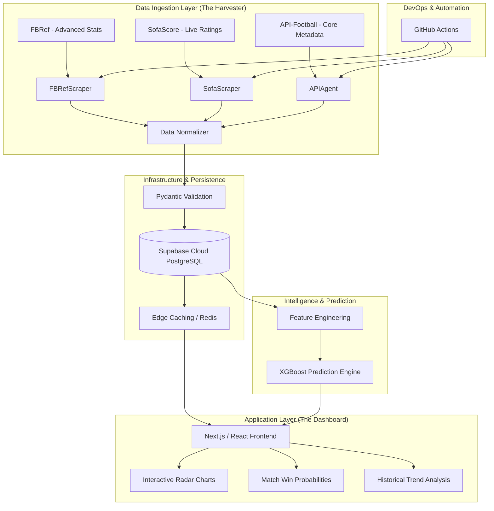

# 🏗️ Football Analytics Ecosystem: Technical System Design

## 1. High-Level Architecture
The system follows a **Decoupled Data Architecture (DDA)**. It separates the volatile, high-latency data collection layer from the high-performance, user-facing analytical dashboard.

---

## 2. Detailed Component Specification

### 🛰️ A. Data Harvester (ETL Engine)
*   **Engine:** Python-based asynchronous workers.
*   **Strategy:** Multi-source "Merge & Conflict Resolution". 
    *   *Conflict Example:* If FBRef says "L. Messi" and API-Football says "Lionel Messi", the `Data Normalizer` uses a fuzzy-matching algorithm (Levenshtein distance) to ensure a single unique ID in the database.
*   **Resilience:** 
    *   Dynamic User-Agent rotation.
    *   Exponential backoff for rate-limited requests.
    *   Headless browser (Playwright) for JS-rendered data from SofaScore.

### ☁️ B. Cloud Data Store (Supabase)
The database is structured for high-speed analytical queries (OLAP style).

| Table | Primary Keys | Key Columns |
| :--- | :--- | :--- |
| `players` | `id` | `name`, `current_club_id`, `market_value`, `nationality` |
| `stats_advanced` | `player_id`, `season` | `xG`, `xA`, `progressive_passes`, `pressures`, `touches_in_box` |
| `fixtures` | `fixture_id` | `home_id`, `away_id`, `predicted_prob`, `actual_score` |
| `team_form` | `team_id`, `date` | `rolling_xG`, `defensive_efficiency`, `momentum_score` |

### 🧠 C. Intelligence Layer (ML Engine)
*   **Model:** XGBoost Classifier.
*   **Features:** Weighted moving averages of the last 10 games, head-to-head history, and "Injury Impact" scores.
*   **Validation:** Automated "Brier Score" tracking to measure how close our predictions are to actual outcomes.

### 🎨 D. Modern Frontend (Phase 3 Transition)
The dashboard will transition from Streamlit to a **Next.js 14+ (App Router)** architecture for production-grade speed and SEO.
*   **State Management:** React Context + SWR (Stale-While-Revalidate) for instant data fetching.
*   **Visuals:** `Recharts` for radar charts and `Framer Motion` for smooth interactive transitions.
*   **UI System:** Tailwind CSS + Shadcn/UI (Radix UI) for a "Spotify-style" dark aesthetic.

---

## 3. Security & Scalability
*   **Authentication:** Supabase Auth (JWT) to secure user-specific watchlists.
*   **API Security:** All database access is gated behind Row Level Security (RLS) policies.
*   **Deployment:** 
    *   **Frontend:** Vercel (Global Edge Network).
    *   **Data Engine:** GitHub Actions + Render (Internal Web Service).
    *   **Monitoring:** Sentry for error tracking and Loguru for structured logging.

---

## 4. Development Workflow
1.  **Phase 1 (Done):** Robust local SQLite caching and Pydantic validation.
2.  **Phase 1.5 (Active):** FBRef/SofaScore independent scraper project.
3.  **Phase 2:** Automated Cloud Sync (GitHub Actions -> Supabase).
4.  **Phase 3:** Full React/Next.js frontend migration.
